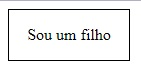

# Flexbox - o santo remédio do alinhamento
 
 
Em um mundo não muito distante a grande maioria dos desenvolvedores web detestavam alinhamento no CSS pela sua dificuldade em fazer algo simples.
 
Os códigos eram cheio de `float`, `absolute`, `relative` que deixava tudo muito frágil à medida’ que a responsividade ia ganhando mais espaço, até que alguma alma iluminada - ou almas - introduziram uma nova feature para o CSS o `display: flex;`.
 
 
### 🤩 É tão fácil assim mesmo? Realmente!
 
Extremamente, ouso a dizer que você aprendendo uma única vez - e pondo em prática -, conseguirá criar, editar e dar manutenção em **90%** dos layouts web.
 
Vou tentar ser o mais direto possível aqui a fim de ajudar de maneira mais rápida os principais conceitos, mas também sugiro você se aprofundar um pouco mais na documentação oficial.
 
[Documentação oficial](https://developer.mozilla.org/pt-BR/docs/Learn/CSS/CSS_layout/Flexbox)
 
### 🙏🏻 O pai, o filho e o flexbox
 
O conceito principal que você precisa saber no início é que o display flexbox trabalha da seguinte forma:
- Você precisa atribuir um **flex-container**
- Automaticamente tudo que estiver dentro dele vai ser um **flex-item**
 
#### Mas que diabos é `flex container` e `flex item`?
 
Veja o seguinte código **HTML**.
 
````
<div class="pai">
    <div class="filho>
    <p> Sou um filho </p>
    </di>
</div>
````
 
Existe um `div` que envolve tudo, ela recebeu a classe "pai" e a outra `div` que **está dentro dela**, recebeu a classe de "filho".
 
No momento em que você aplicar o `display: flex;` via CSS na classe "pai" ela se transformará em um "Flex Container", e todo o resto - seja `<div>`, `<h1>`, `<p>`, **TUDO** - será um `flex item`
 
```
.pai {
    display: flex;
}
```
 
**Resumindo**: Todo elemento no qual você atribuir o `display: flex;` se transformará em um **container**. Tudo que estiver dentro dele se transformará em um **item**.
 
### 📏📐 Alinhamento do flex item dentro do container
 
No momento em que um elemento se transforma em um `flex-item` ele consegue se alinhar apenas dentro do `flex-container`.
 
Vou utilizar o código HTML acima pra exemplificar, melhor:
````
<div class="pai">
    <div class="filho">
    <p> Sou um filho </p>
    </di>
</div>
````
 
Se você atribuir - via CSS - que a `<div class="pai">` tenha um `width` de **120px** o `flex-item` dele que é a `<div class="filho">` só conseguirá se mover dentro dos **120px do pai**, percebeu que maravilha?
 
Agora basta você pedir a seguinte coisa para o CSS:
 
"Meu querido, você poderia alinhar o `flex-item` ao centro"
 
E você verá a mágica acontecendo!
 
A `<div class="filho">` ficará alinhada exatamente ao centro dos 120px atribuídos à `<div class="pai">`.
 
E sabe qual é a melhor parte disso tudo? Você também consegue atribuir o `display: flex;` a `<div class="filho">` e tudo que está dentro dela, no caso o `<p> Sou um filho </p>` se transformará em um `flex-item` e você poderá alinhar da mesma forma.
 
É a herança do flexbox.
 
## 🎛️ Como pedir ao CSS que trabalhe no flexbox?
 
O `display: flex;` possui diversas propriedades, que recomendo fortemente que você ao menos leia sobre elas, mas nesse repositório vou explicar as principais para se começar a usar o flebox de maneira prática.
 
**`flex-direction`**: essa propriedade configura se os elementos filhos `flex-item` serão alinhados em forma de **linha**(row) ou **coluna**(column).
 
**`justify-content`**: essa propriedade é utilizada para você alinhar todos os elementos filhos em uma linha **horizontal**(da esquerda para a direita) dentro do `flex-container`.
 
**`align-items`**: essa propriedade é utilizada para você alinhar todos os elementos filhos em uma linha **vertical**(de cima para baixo) dentro do `flex-container`.
 
Essas duas propriedades recebem os mesmos parâmetros de configuração, que são:
**`center`**: alinha tudo ao centro.
**`flex-start`**: alinha tudo ao ínicio.
**`flex-item`**: alinha tudo ao final.
 
o **`justify-content`**, recebe também os seguintes parâmetros caso você queria:
**`space-between`**: espaça os elementos na vertical para que eles preencham todo o espaço do elemento pai, sem esticar os componentes.
**`space-around`**: espaça os elementos filhos dentro do elemento pai, porém deixando uma pequena margem entre as pontas, como se você tivesse atribuído à propriedade `margin` aos elementos filhos.
**`space-evenly`**: espaça da mesma forma como o `space-around` porém criando um espaçamento maior ao final.
 
Utilizando o HTML base que criamos, a atribuição do CSS para que o elemento filho seja alinhado ao centro será:
 
```
.pai {
    display: flex;
    justify-content: center;
    align-items: center;
    width: 120px;
    height: 50px;
    border: 1px solid black;
}
```
Os comandos de alinhamento devem ser atribuídos ao elemento pai, como fiz aí no exemplo. Após isso você verá que em apenas poucas linhas o alinhamento estará perfeitamente alinhado ao centro.
 
Aproveitei e também inseri propriedades de altura e borda para você ver o elemento se alinhando na vertical também.

E o resultado será esse: 🪄



O elemento filho alinhado dentro do elemento pai.
 
 
## 👨🏻‍💻 Por fim
 
Volto a comentar que esse é um tutorial bem simples de como começar a usar o `flexbox` na prática e aconselho que você estude e pratique as outras propriedades dele.
 
Além do mais eu preparei esse repositório para ajudar principalmente quem está começando a programar, uma das minhas principais motivações a estudar sempre foi perceber o quanto a comunidade me abraçou e ensinou de graça e sem questionamentos.
 
Um vez um amigo meu me disse:
 
_"Aprendeu? agora ensine!"_
 
Sei que tenho muito a aprender, só de saber que passar adiante esse conhecimento pode ajudar outra pessoa, é o que me move a acordar cedo todos os dias para estudar.
 
Bons estudos!
 
 
 
 
 
 

